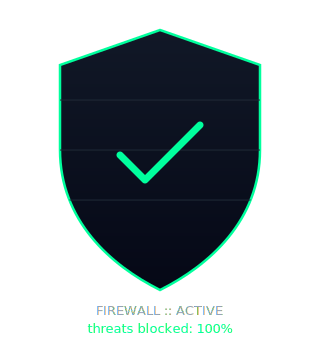

<div align="center">

<!-- ============ BOOT SEQUENCE ============ -->


</div>

<br/>

<!-- ============ IDENTITY VERIFICATION ============ -->
<div align="center">


<br/>

<a href="https://www.linkedin.com/in/rethish-s-25a377372"></a>
<a href="https://x.com/rethishsugu28"></a>
<a href="mailto:rethiofficial1828@gmail.com"></a>
<a href="https://rethiofficial1828-reka.github.io/Portfolio/"></a>

</div>


<!-- ============ OS LOADING ============ -->
<div align="center">

### `SYSTEM // 02_OS_LOADING`

```
[██████████████████████████████████████████████░░░░]  94%
loading modules → security.ko  network.ko  ai_core.ko  ✔ done
```

</div>


<!-- ============ AI INITIALIZATION ============ -->
<div align="center">

### `SYSTEM // 03_AI_INITIALIZATION`



<sub>Reactor online. Neural pathways calibrated to curiosity-first learning mode.</sub>

</div>


<!-- ============ MISSION CONTROL ============ -->
<div align="center">

### `SYSTEM // 04_MISSION_CONTROL`

| ◉ OPERATOR | ◉ STATUS | ◉ FOCUS | ◉ CLEARANCE |
|:---:|:---:|:---:|:---:|
| Rethish S | `ACTIVE` | Security · Networks · Automation | Level 2 — Trainee |


</div>


<!-- ============ SECURITY OPERATIONS CENTER ============ -->
<div align="center">

### `SYSTEM // 05_SECURITY_OPERATIONS_CENTER`

<table>
<tr>
<td align="center" width="50%"></td>
<td align="center" width="50%"></td>
</tr>
<tr>
<td align="center"><sub>Perimeter defense — training environment</sub></td>
<td align="center"><sub>Network sweep — passive monitoring mode</sub></td>
</tr>
</table>

</div>


<!-- ============ DEVELOPER ARSENAL ============ -->
<div align="center">

### `SYSTEM // 06_DEVELOPER_ARSENAL`

<sub>Skill constellation — nodes light up in proportion to hands-on repetition, not just exposure.</sub>


```
C Programming          ████████████████░░░░  80%
Python                 ███████████████░░░░░  75%
Linux / Bash           ██████████████░░░░░░  70%
Networking Basics      ████████████░░░░░░░░  60%
Security Concepts      █████████████░░░░░░░  65%
CTF / Problem Solving  ██████████████░░░░░░  72%
```

</div>


<!-- ============ RESEARCH LABORATORY ============ -->
<div align="center">

### `SYSTEM // 07_RESEARCH_LABORATORY`

<sub>Logged coursework and certifications — verified training records.</sub>

<!--CERTS:START-->
| Year | Research Document | Issuing Lab |
|:---:|:---|:---|
| 2024 | 💻 C Programming Certification | Online Platform |
| 2024 | 🐍 Python Programming Certification | Online Platform |
<!--CERTS:END-->

<sub>✏️ Add entries in <code>json/certificates.json</code> — this table rebuilds automatically via the update workflow.</sub>

</div>


<!-- ============ PROJECT DATABASE ============ -->
<div align="center">

### `SYSTEM // 08_PROJECT_DATABASE`

<sub>⚠ CLASSIFIED — clearance level 2 · files below are declassified for public view</sub>

<!--REPOS:START-->
| File ID | Codename | Stack | Access |
|:---:|:---|:---:|:---:|
| `RS-001` | Portfolio | HTML | [open file](https://github.com/rethiofficial1828-reka/Portfolio) |
| `RS-002` | sports-fest | TypeScript | [open file](https://github.com/rethiofficial1828-reka/sports-fest) |
| `RS-003` | Final-Polish-Documentation-Demo | JavaScript | [open file](https://github.com/rethiofficial1828-reka/Final-Polish-Documentation-Demo) |
| `RS-004` | Rethish-S | — | [open file](https://github.com/rethiofficial1828-reka/Rethish-S) |
<!--REPOS:END-->

<sub>🔒 Private files: none exposed to unauthenticated scans. Enable the update workflow with a PAT to list private file *names* (contents stay sealed).</sub>

</div>


<!-- ============ GLOBAL NETWORK ============ -->
<div align="center">

### `SYSTEM // 09_GLOBAL_NETWORK`


<!-- Contribution snake — activates once .github/workflows/snake.yml has run once on the default branch -->


</div>


<!-- ============ ACHIEVEMENTS VAULT ============ -->
<div align="center">

### `SYSTEM // 10_ACHIEVEMENTS_VAULT`



<!--HACK:START-->
| Vault Entry | Event | Year | Seal |
|:---:|:---|:---:|:---:|
| #1 | CTF Hackathon | 2025 | 🥉 3rd Place |
| #2 | REPLACE_ME — hackathon name | REPLACE_ME | 🎖️ 4th Place |
<!--HACK:END-->


</div>


<!-- ============ FUTURE ROADMAP ============ -->
<div align="center">

### `SYSTEM // 11_ROADMAP.log`

```
[2026 Q3] ▸ deepen network security fundamentals (labs + CTFs)
[2026 Q4] ▸ ship first automation tool (Python + Linux)
[2027 Q1] ▸ target: entry-level SOC / security internship
[2027 Q2] ▸ contribute to an open-source security tool
```

</div>


<!-- ============ COMMUNICATION TERMINAL ============ -->
<div align="center">

### `SYSTEM // 12_COMMUNICATION_TERMINAL`

```bash
$ ./connect --to=rethish --reason="collab|internship|mentorship"
> connection queued. average response time: <24h
> open channels: email · linkedin · x
```

<a href="mailto:rethiofficial1828@gmail.com"></a>
<a href="https://www.linkedin.com/in/rethish-s-25a377372"></a>
<a href="https://x.com/rethishsugu28"></a>

<br/><br/>

<details>
<summary><sub>🔓 <code>sudo access --secret-logs</code></sub></summary>
<br/>

```
$ cat /var/log/hacker_wisdom.txt
"The quieter you become, the more you are able to hear." — anon
"There is no patch for human stupidity." — anon

$ history | grep easter_egg
1826  echo "you weren't supposed to find this"
1827  # try the konami code on the pinned repo widgets. nothing happens yet. that's the joke.
```

</details>

</div>


<!-- ============ SHUTDOWN SEQUENCE ============ -->
<div align="center">


<sub>© 2026 Rethish S — connection will remain open. shutting down display, not the mission.</sub>

</div>
